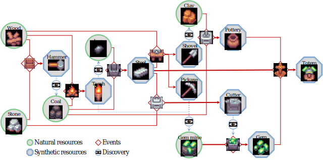

# *AdaSociety*

[](https://arxiv.org/abs/2411.03865)


## Resources

There are 15 kinds of built-in resources in *AdaSociety*, which can be divided into *Natural Resources* and *Synthesized Resources* based on whether they can be produced through events. Some of the natural resources can only be discovered and gathered by agents with certain resources (denoted by *Requirement*) in their inventories.

| Resource  | Wood | Stone | Hammer | Coal | Torch | Iron | Steel | Shovel | Pickaxe | GemMine | Clay | Pottery | Cutter | Gem | Totem |
|-----------|------|-------|--------|------|-------|------|-------|--------|---------|---------|------|---------|--------|-----|-------|
| Synthesized | :x: | :x: | :heavy_check_mark: | :x: | :heavy_check_mark: | :x: | :heavy_check_mark: | :heavy_check_mark: | :heavy_check_mark: | :x: | :x: | :heavy_check_mark: | :heavy_check_mark: | :heavy_check_mark: | :heavy_check_mark: |
| Requirement | - | - | - | Hammer | - | Torch | - | - | - | Pickaxe | Shovel | - | - | - | - |
| Objective reward | 1 | 1 | 5 | 2 | 20 | 3 | 30 | 100 | 150 | 4 | 4 | 40 | 100 | 200 | 1000 |

## Events

There are 9 built-in events in *AdaSociety*. Each event takes 2 to 3 kinds of resources as input and outputs 1 kind of product. Events can only be observed and executed by agents whose inventories meet the event requirements.

| Event | Input1 | Input2 | Input3 | Output | Requirement1 | Requirement2 |
|-------|--------|--------|--------|--------|--------------|--------------|
| HammerCraft | 1Wood | 1Stone | - | 1Hammer | - | - |
| TorchCraft | 1Wood | 1Coal | - | 1Torch | Coal | - |
| SteelMaking | 1Iron | 1Coal | - | 1Steel | Iron | - |
| Potting | 2Clay | 1Coal | - | 1Pottery | Clay | - |
| ShovelCraft | 2Steel | 2Wood | - | 1Shovel | Steel | - |
| PickaxeCraft | 3Steel | 2Wood | - | 1Pickaxe | Steel | - |
| CutterCraft | 2Steel | 3Stone | - | 1Cutter | Steel | - |
| GemCutting | 1GemMine | - | - | 1Gem | Cutter | GemMine |
| TotemMaking | 2Gem | 1Pottery | 1Steel | 1Totem | Gem | - |



## Inventories

Every agent has an inventory with maximal capacities of every resource, implying skill diversity. For example, an agent with a $0$ capacity for hammers cannot possess hammers and observe coal. Agents can collect resources from the map into their inventories and dump resources on the map. Agents' rewards are attached to the resources in their inventories, while they exhibit heterogeneity in resource preferences. Specifically, for agent $i$, the reward of resource $\rho$ is $R_i(\rho) = m_i^{\rho} \cdot h_i(\rho) \cdot \overline{r}^{\rho}$, where $m_i^{\rho}$ is the amount of resource $\rho$ in the inventory of agent $i$, $h_i(\rho) \in \mathbb{R}$ represents the preference of agent $i$ for $\rho$, $\overline{r}^{\rho}$ is the objective reward of a unit of $\rho$.

## Observation
| Name | Description | Type |
| ---- | ---- | ---- |
| episode_id | Current episode id. | *int* |
| step_id | Current step id. | *int* |
| **Resource**| | |
| name | Resource name. | *str* |
| position | Resource absolute coordinate <br> the position of resources in inventory is `None`. | [x: *int*, y: *int*] |
| amount | Resource number. | *int* |
| **Event** | | |
| name | Event name. | *str* |
| position | Event absolute coordinate. | [x: *int*, y: *int*] |
| **Player** | | |
| id | Player ID. | *int* |
| name | Player name. | *str* |
| position | Player's absolute coordinate. | [x: *int*, y: *int*] |
| inventory | Player's inventory, every player can only observe her own inventory. | [`resource_1`, `resource_2`, ...] |
| **Map** | | |
| block_grids | An agent-centered observable map of blocks.<br> 1 stands for block, and 0 stands for blank. | 2D-array|
| resources | Observable resources list. | [`resource_1`, `resource_2`, ...] |
| events | Observable events list. | [`event_1`, `event_2`, ...] |
| players | Observable players list (exclude self). | [`player_1`, `player_2`, ...] |
| **Sharing** | | |
| Map | shared vision, same structure as **Map**. | `Map` |
| **Node** | | |
| type | Node type, player or group. | *player* or *group*|
| *player* | Player node attribute. | {'id': xxx} |
| *group* | Group node attribute. | {'id': xxx, 'member': [xxx, ...]} |
| name | Node name. | *str* |
| **Edge** | | |
| name | Edge name. | *str* |
| from | Out-degree node <br> type: 'player' or 'group'. <br> id: node_id. |  {'type': xxx, 'id': xxx} |
| to | In-degree node <br> type: 'player' or 'group'. <br> id: node_id. | {'type': xxx, 'id': xxx} |
| attribute | Attributes on the edge. | {'attribute_name': attribute_value} |
| **Social** | | |
| sharings | The shared information among agents. | {player_id: `sharing`, player_id: `sharing`, ...}|
| global | The gloabl social graph information<br> list of nodes and edges. | {'nodes': [`node_1`, ...], 'edges': [`edge_1`, ...] }          |

### Example:
```json
{
  "episode_id": 123,
  "step_id": 456,
  "Map": {
    "block_grids": [
      [1, 1, 0, 1],
      [1, 0, 0, 1],
      [1, 0, 1, 1]
    ],
    "resources": [
      {"name": "wood", "position": [1, 1], "num": 3}
    ],
    "events": [
      {"name": "hammer_craft", "position": [2, 1]}
    ],
    "players": [
      {"id": 0, "name": "Adam", "position": [1, 2]}
    ]
  },
  "Player": {
    "id": 1,
    "name": "Eva",
    "position": [3, 0],
    "inventory": [
      {"name": "stone", "num": 10}
    ]
  },
  "Social": {
    "sharings": {
    "player_id":{
        "map": {
            "block_grids": [
              [1, 1, 0, 1],
              [1, 0, 0, 1],
              [1, 0, 1, 1]
            ],
            "resources": [
              {"name": "stone", "position": [1, 1], "num": 2}
            ],
            "events": [
              {"name": "torch_craft", "position": [3, 1]}
            ],
            "players": [
              {"id": 3, "name": "Bob", "position": [3, 2]}
            ],
            }
        }
    },
    "global":{
      "nodes":[
        {"type": "player", "player": {"id": 0}},
        {"type": "player", "player": {"id": 1}},
        {"type": "group", "group": {"id": 0}},
      ],
      "edges":[
        {
          "name": "sharing_obs",
          "from": {"type": "player", "id": 0},
          "to": {"type": "player", "id": 1},
          "attribute": {"sharing": {"Map": true}}
        }
      ]
    }
  }
}

```

## Action
| Name | Description | Parameter |
| ---- | ---- | ----|
| no_act | Do nothing. | - |
| **Move** | | |
| move_up | Move up. | - |
| move_down | Move down. | - |
| move_left | Move left. | - |
| move_right | Move right. | - |
| **Resource** | | |
| pick_by_name | Pick up one unit of resource from the map. | *resource_name*: Resource name. |
| dump_by_name | Dump one unit of resource from the inventory. | *resource_name*: Resource name. |
| **Event**| | |
| produce | Perform a produce action on an event grid on the map, consuming the required items from the inventory and obtaining the produced resource. | - |
| **Social** | | |
| add_relation | Establish a relation with a player. | *to_player_id*: The id of the target player; <br> (attributes_dict): The attributes of the relation. |
| remove_relation | Deletes the specified attribute relation with one player. | (to_player_id): The id of the target player; <br> (attribute_name): The attributes of the relation. |
| join_group | Join a group and add attributes. | (group_id): The group want to join; <br> (attribute_dict): The group's attributes.|
| quit_group | Quit a group that has a specified attribute. | (group_id): The group want to quit; <br> (attribute_name): The group's attribute.|

### Examples:
```json
[
  {
    "action": "move_up",
  },
  {
    "action": "pick_by_name",
    "kwargs":{
      "resource_name": "wood"
    }
  },
  {
    "action": "add_relation",
    "kwargs":{
      "player": 1,
      "attributes_dict": {
        "matching_request_step": 0
      }
    }
  },
  {
    "action": "quit_group",
    "kwargs":{
      "group_id": 2,
      "attribute_name": "score"
    }
  }
]
```
## Customization

| Element | Parameter | Description |
|---------|-----------|-------------|
| Mapsize | $h, w$ | Map height and map width. |
| Terrain | $B$ | Terrain set $B=\lbrace b_1, \cdots, b_{\|B\|} \rbrace$. $b_i$ represents a block. |
|         |          | $b_i^{pos}$: the position of block $b_i$ on the map which can be assigned or randomly generated. |
| Resource | $\varrho$ | Set of resources $\varrho = \lbrace \rho_1, \cdots,\rho_{\|\varrho\|} \rbrace$. Each resource $\rho_i$ has an attribute $\rho_i^{req}$. |
|          |            | $\rho_i^{req}$: Necessary resources in agents' inventories to observe \& collect $\rho_i$. |
|          | $\rho_{temp}$ | Temporary resources (Defined by specifying $\rho_{temp}^{req}$) |
| Event | $\mathcal{E}$ | Set of events $\mathcal{E}=\lbrace \epsilon_1, \cdots, \epsilon_{\|\mathcal{E}\|} \rbrace$. Each event $\epsilon_i$ has attributes $\epsilon_i^{in}, \epsilon_i^{out}, \epsilon_i^{req}$. |
|       | $\epsilon_i^{in}$ | Resources consumed by event $\epsilon_i$. |
|       |  $\epsilon_i^{out}$ | Resources produced by event $\epsilon_i$. |
|       |  $\epsilon_i^{req}$ |  Necessary resources in agents' inventories to observe \& execute $\epsilon_i$. |
|       | $\mathcal{E}^{pos}$ | Event positions $\mathcal{E}^{pos} = \lbrace \epsilon_1^{pos}, \cdots, \epsilon_{\|\mathcal{E}\|^{pos}} \rbrace$. Each $\epsilon_i^{pos}$ represents a list of positions of $\epsilon_i$. |
|       | $\epsilon_{temp}$ | Temporary events (Defined by specifying $\epsilon_{temp}^{in}, \epsilon_{temp}^{out}, \epsilon_{temp}^{req}$) |
| Agent | $P$ | Set of agents $P=\lbrace 1, \cdots, \|P\| \rbrace$ |
|       | $m_i(0)$ | Initial inventories. $m^{\rho}_i(0)$ denotes the initial number of resource $\rho$ in inventories. |
|       | $i^{cap}$ | Inventory capacity. $i^{cap}$: $\varrho\to\mathbb{R}$ denotes maximum quantities of resources $i$ can carry. |
|       | $h_i$ | $h_i$: $\varrho\to\mathbb{R}$ denotes quantities of credits $i$ gets by acquiring resources. The actual reward obtained by $i$ is $h_i$ multiplied by the objective reward of the resource.|
|       | $i^{pos}(0)$ | Initial positions of agents which can be predefined or generated randomly. |

## Installation

To get started with the project, clone the repository and run the following command to install the required dependencies:

```shell
pip install -r requirements.txt
```

We plan to publish this repository as a Python package in the future.

## Customization
***AdaSociety*** offers two primary methods for customizing the multi-agent environment:

1. **JSON Configuration**: Users can easily adjust environment parameters by passing settings in JSON format. Customizable configurations include:
   - Map size
   - Number, location and generation method  of blocks
   - Types and quantities of resources
   - Event types and their respective quantities and generation methods
   - Initial social structure and its evolution
   - Specification of pre-update and post-update functions for each environment step
   - Number of agents, their inventory capacity, and preferences

   Additionally, users can customize non-built-in resources, events, and agent types. For a detailed description, please refer to [JSON Configuration File Documentation](./config/README.md).

2. **Custom Python Code**: Users can gain greater flexibility and control by crafting custom `env_handler` and `agent` classes through Python code. This allows for:
   - Implementation of custom observation processing functions and reward functions
   - Action translations for agents
   - Application of meta control within the environment, such as defining the rotation order of agents.

		For a detailed description, please refer to [Agent and Environment Handler Implementation](./project/agent/README.md).

## Mini-games
For detailed instructions on each mini-game, consult the following documents: 
 - [Contract](./project/tasks/contract/README.md)
 - [Exploration](./project/tasks/exploration/README.md)
 - [Negotiation](./project/tasks/negotiation/README.md)
 - [Social Structure](./project/tasks/social_structure/README.md)

## Running and Training

Here are some key files and folders to run the environment and train the agents:

- **Environment running:** `project/env/` is the main folder in which ***AdaSociety*** runs. It contains the important components, such as **event**, **resource**, **player**.

- **Agents training:** ***AdaSociety*** is a general environment that supports implementing arbitrary algorithms on top of it and is compatible with all popular RL libraries.

We implemented an adaptation of ***AdaSociety*** for the well-known library [RLlib](https://docs.ray.io/en/latest/rllib/index.html). `project/RLlib/` contains the modules needed to train agents using the RLlib framework, like `network` and `policy`. `train/train.py` in this folder is the main script which creates the environment instance and runs the RL algorithm.`rllib_train.py` serves as the entry point for executing the training process. It reads and processes command-line arguments and passes the parsed arguments to `RLlib/train.py` to configure the training run. 

Please check further details and examples for using RLlib for ***AdaSociety*** in [Training agents via RLlib in *AdaSociety*](./project/RLlib/README.md).

***AdaSociety*** also supports using LLM to control agents. We provide an implementation, and please see [LLM](./project/tasks/llm) for details.

## Citation

Our paper is available on [ArXiv](https://arxiv.org/abs/2411.03865). If you find our work or code useful, we would greatly appreciate it if you could give us a star and consider citing our paper:

```bibtex
@inproceedings{
huang2024adasociety,
title={AdaSociety: An Adaptive Environment with Social Structures for Multi-Agent Decision-Making},
author={Yizhe Huang and Xingbo Wang and Hao Liu and Fanqi Kong and Aoyang Qin and Min Tang and Xiaoxi Wang and Song-Chun Zhu and Mingjie Bi and Siyuan Qi and Xue Feng},
booktitle={The Thirty-eight Conference on Neural Information Processing Systems Datasets and Benchmarks Track},
year={2024}
}
```